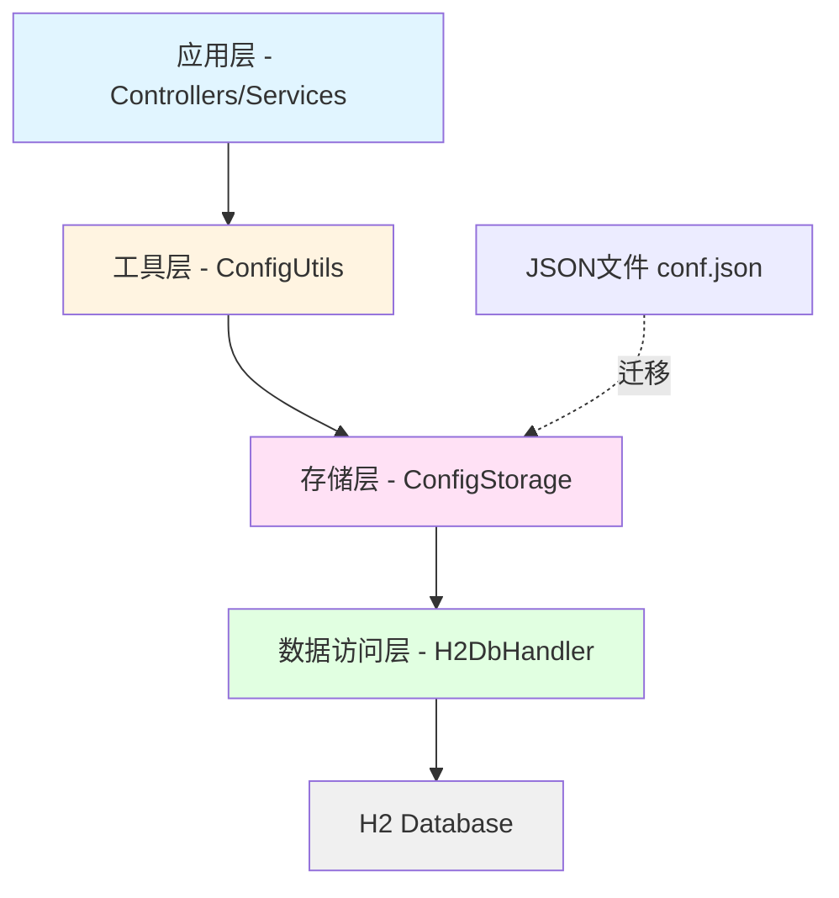

# Design Document: ConfigInfo H2存储

## Overview

本设计文档描述了将ConfigInfo配置信息从JSON文件存储迁移到H2数据库存储的技术实现方案。该方案采用分层架构，通过引入ConfigStorage服务层来封装H2数据库操作，同时保持ConfigUtils工具类的API向后兼容。

核心设计理念：
- **最小侵入性**：保持现有ConfigUtils API不变，仅修改内部实现
- **数据持久化**：使用H2嵌入式数据库替代JSON文件存储
- **平滑迁移**：自动检测并迁移现有JSON配置到数据库
- **错误恢复**：完善的异常处理和事务管理

## Architecture

系统采用三层架构设计：



**层次说明**：

1. **应用层**：现有的Controller和Service代码，通过ConfigUtils获取配置
2. **工具层（ConfigUtils）**：提供配置访问的统一接口，内部委托给ConfigStorage
3. **存储层（ConfigStorage）**：封装配置的CRUD操作，管理H2数据库连接
4. **数据访问层（H2DbHandler）**：复用现有的H2数据库操作类
5. **数据库层**：H2嵌入式数据库，存储配置数据

## Components and Interfaces

### 1. ConfigStorage（新增组件）

配置存储服务，负责配置信息的持久化管理。

**职责**：
- 初始化H2数据库和表结构
- 提供配置的CRUD操作
- 处理JSON到数据库的迁移
- 管理数据库连接生命周期

**接口定义**：

```java
public class ConfigStorage {
    
    /**
     * 初始化配置存储
     * 创建H2数据库连接和表结构
     */
    public void initialize();
    
    /**
     * 保存配置信息到数据库
     * @param config 配置信息对象
     */
    public void saveConfig(ConfigInfo config);
    
    /**
     * 从数据库读取所有配置
     * @return 配置信息对象
     */
    public ConfigInfo loadConfig();
    
    /**
     * 根据title查询配置
     * @param title 配置标题
     * @return 数据库连接信息，未找到返回null
     */
    public DBInfo getDbInfoByTitle(String title);
    
    /**
     * 根据title删除配置
     * @param title 配置标题
     * @return 是否删除成功
     */
    public boolean deleteConfig(String title);
    
    /**
     * 从JSON文件迁移配置到数据库
     * @param jsonFilePath JSON文件路径
     */
    public void migrateFromJson(String jsonFilePath);
    
    /**
     * 关闭数据库连接
     */
    public void close();
}
```

### 2. ConfigUtils（修改组件）

保持现有API不变，内部实现改为使用ConfigStorage。

**修改内容**：
- 移除直接的文件操作代码
- 添加ConfigStorage实例
- 修改saveConf()方法调用ConfigStorage.saveConfig()
- 修改readConf()方法调用ConfigStorage.loadConfig()
- 保持getConfig()和getDbInfo()方法签名不变

**修改后的实现**：

```java
public class ConfigUtils {
    
    private static ConfigInfo config = null;
    private static ConfigStorage storage = new ConfigStorage();
    
    static {
        // 初始化时自动加载配置
        storage.initialize();
        readConf();
    }
    
    public static ConfigInfo getConfig() {
        return ConfigUtils.config;
    }
    
    public static DBInfo getDbInfo(String title) {
        return storage.getDbInfoByTitle(title);
    }
    
    /**
     * 保存配置到H2数据库
     */
    public static void saveConf(ConfigInfo info) {
        storage.saveConfig(info);
        config = info;
    }
    
    /**
     * 从H2数据库读取配置
     */
    public static void readConf() {
        config = storage.loadConfig();
    }
}
```

### 3. H2DbHandler（复用组件）

复用现有的H2DbHandler类，用于执行数据库操作。

**使用方式**：
- ConfigStorage内部创建H2DbHandler实例
- 使用H2Info配置嵌入式数据库连接
- 通过JdbcTemplate执行SQL操作

## Data Models

### 1. 数据库表结构

**表名**：`db_config`

**字段定义**：

| 字段名 | 类型 | 约束 | 说明 |
|--------|------|------|------|
| id | BIGINT | PRIMARY KEY AUTO_INCREMENT | 主键ID |
| title | VARCHAR(255) | NOT NULL UNIQUE | 配置标题（唯一标识） |
| host | VARCHAR(255) | NOT NULL | 主机地址 |
| uname | VARCHAR(255) | NOT NULL | 用户名 |
| upass | VARCHAR(255) | NOT NULL | 密码 |
| port | INT | NOT NULL | 端口号 |
| dbname | VARCHAR(255) | NOT NULL | 数据库名 |
| dbtype | VARCHAR(50) | NOT NULL | 数据库类型（mysql/maria） |
| created_at | TIMESTAMP | DEFAULT CURRENT_TIMESTAMP | 创建时间 |
| updated_at | TIMESTAMP | DEFAULT CURRENT_TIMESTAMP ON UPDATE CURRENT_TIMESTAMP | 更新时间 |

**建表SQL**：

```sql
CREATE TABLE IF NOT EXISTS db_config (
    id BIGINT PRIMARY KEY AUTO_INCREMENT,
    title VARCHAR(255) NOT NULL UNIQUE,
    host VARCHAR(255) NOT NULL,
    uname VARCHAR(255) NOT NULL,
    upass VARCHAR(255) NOT NULL,
    port INT NOT NULL,
    dbname VARCHAR(255) NOT NULL,
    dbtype VARCHAR(50) NOT NULL,
    created_at TIMESTAMP DEFAULT CURRENT_TIMESTAMP,
    updated_at TIMESTAMP DEFAULT CURRENT_TIMESTAMP ON UPDATE CURRENT_TIMESTAMP
);
```

### 2. H2数据库配置

**连接信息**：

```java
H2Info configDbInfo = new H2Info();
configDbInfo.setTitle("config-storage");
configDbInfo.setDbname("config");
configDbInfo.setDbtype("h2");
configDbInfo.setEmbedded(true);
configDbInfo.setFilePath("./data/config");
configDbInfo.setMode("MySQL");
configDbInfo.setUname("sa");
configDbInfo.setUpass("");
```

**连接URL**：`jdbc:h2:file:./data/config;MODE=MySQL`

### 3. 数据映射

**DBInfo到数据库记录的映射**：

```java
// 保存时：DBInfo -> Map
Map<String, Object> toMap(DBInfo info) {
    Map<String, Object> map = new HashMap<>();
    map.put("title", info.getTitle());
    map.put("host", info.getHost());
    map.put("uname", info.getUname());
    map.put("upass", info.getUpass());
    map.put("port", info.getPort());
    map.put("dbname", info.getDbname());
    map.put("dbtype", info.getDbtype());
    return map;
}

// 读取时：Map -> DBInfo
DBInfo fromMap(Map<String, Object> row) {
    String dbtype = (String) row.get("dbtype");
    DBInfo info;
    
    if ("mysql".equals(dbtype)) {
        info = new MySQLInfo();
    } else if ("maria".equals(dbtype)) {
        info = new MariaDBInfo();
    } else {
        throw new IllegalArgumentException("Unknown dbtype: " + dbtype);
    }
    
    info.setTitle((String) row.get("title"));
    info.setHost((String) row.get("host"));
    info.setUname((String) row.get("uname"));
    info.setUpass((String) row.get("upass"));
    info.setPort((Integer) row.get("port"));
    info.setDbname((String) row.get("dbname"));
    info.setDbtype(dbtype);
    
    return info;
}
```

## Correctness Properties

*属性（Property）是系统在所有有效执行中应该保持为真的特征或行为——本质上是关于系统应该做什么的形式化陈述。属性是人类可读规范和机器可验证正确性保证之间的桥梁。*

在编写正确性属性之前，我需要先分析需求文档中的验收标准，确定哪些可以转化为可测试的属性。


### Property 1: 配置保存和读取的往返一致性

*对于任意* ConfigInfo对象，保存到数据库后再读取，应该得到等价的ConfigInfo对象（包含相同的mysqls和marias列表，且每个DBInfo的所有字段值相同）

**Validates: Requirements 2.1, 2.2, 3.3, 3.4**

**说明**：这是一个往返属性（Round-trip Property），验证序列化和反序列化的正确性。无论ConfigInfo包含多少个MySQL或MariaDB配置，保存后读取都应该完整恢复。

### Property 2: 配置保存的幂等性

*对于任意* DBInfo配置，如果使用相同的title保存两次（第二次可能修改了其他字段），数据库中应该只有一条记录，且记录的字段值等于第二次保存的值

**Validates: Requirements 2.3, 2.4**

**说明**：这是一个幂等性属性（Idempotence），验证upsert语义。系统应该根据title自动判断是插入还是更新。

### Property 3: 类型转换的正确性

*对于任意* 保存的DBInfo配置，读取后返回的对象类型应该与dbtype字段匹配（dbtype="mysql"时返回MySQLInfo实例，dbtype="maria"时返回MariaDBInfo实例）

**Validates: Requirements 3.2**

**说明**：这是一个不变量属性（Invariant），验证类型系统的正确性。

### Property 4: 删除操作的正确性

*对于任意* 已保存的配置title，删除操作后，根据该title查询应该返回null，且删除操作应该返回true

**Validates: Requirements 5.1, 5.2**

**说明**：这是一个状态转换属性，验证删除操作的副作用。

### Property 5: ConfigUtils API的向后兼容性

*对于任意* ConfigInfo对象，通过ConfigUtils.saveConf()保存后，ConfigUtils.getConfig()应该返回等价的对象，且ConfigUtils.getDbInfo(title)应该能查询到列表中的每个配置

**Validates: Requirements 7.2, 7.3**

**说明**：这是一个接口兼容性属性，验证ConfigUtils作为包装器的正确性。

## Error Handling

### 1. 数据库连接错误

**场景**：H2数据库文件损坏或无法创建

**处理策略**：
- 捕获SQLException并包装为ConfigStorageException
- 异常信息包含详细的错误原因和数据库路径
- 记录ERROR级别日志
- 不进行自动重试，由调用方决定处理策略

**示例代码**：

```java
try {
    h2Handler = new H2DbHandler(configDbInfo);
} catch (Exception e) {
    String message = String.format(
        "Failed to connect to config database at %s: %s",
        configDbInfo.getFilePath(), e.getMessage()
    );
    log.error(message, e);
    throw new ConfigStorageException(message, e);
}
```

### 2. 表结构错误

**场景**：db_config表不存在或结构不完整

**处理策略**：
- 在initialize()方法中检查表是否存在
- 如果表不存在，执行CREATE TABLE语句
- 如果表存在但结构不完整，记录WARNING日志但不自动修改（避免数据丢失）
- 提供单独的rebuildTable()方法供管理员手动重建

**示例代码**：

```java
public void initialize() {
    try {
        // 检查表是否存在
        List<String> tables = h2Handler.getTables();
        if (!tables.contains("DB_CONFIG")) {
            createTable();
        }
    } catch (Exception e) {
        log.error("Failed to initialize config storage", e);
        throw new ConfigStorageException("Initialization failed", e);
    }
}
```

### 3. 数据操作错误

**场景**：保存、读取、删除操作失败

**处理策略**：
- 所有写操作（INSERT、UPDATE、DELETE）失败时抛出异常
- 读操作失败时返回空对象而非null（避免NullPointerException）
- 使用事务确保数据一致性
- 记录详细的SQL语句和参数到日志

**示例代码**：

```java
public void saveConfig(ConfigInfo config) {
    try {
        // 开始事务
        h2Handler.getJdbcTemplate().execute("BEGIN");
        
        // 保存配置...
        
        // 提交事务
        h2Handler.getJdbcTemplate().execute("COMMIT");
    } catch (Exception e) {
        // 回滚事务
        h2Handler.getJdbcTemplate().execute("ROLLBACK");
        log.error("Failed to save config", e);
        throw new ConfigStorageException("Save operation failed", e);
    }
}

public ConfigInfo loadConfig() {
    try {
        // 读取配置...
    } catch (Exception e) {
        log.error("Failed to load config, returning empty ConfigInfo", e);
        return new ConfigInfo(); // 返回空对象而非null
    }
}
```

### 4. 数据迁移错误

**场景**：从JSON文件迁移到数据库时失败

**处理策略**：
- 迁移前先验证JSON文件格式
- 迁移过程使用事务，失败时回滚
- 迁移成功后才备份原文件
- 迁移失败时保留原JSON文件不变
- 记录详细的迁移日志

**示例代码**：

```java
public void migrateFromJson(String jsonFilePath) {
    File jsonFile = new File(jsonFilePath);
    if (!jsonFile.exists()) {
        log.info("No JSON file to migrate");
        return;
    }
    
    try {
        // 读取JSON
        String json = FileUtil.readUtf8String(jsonFile);
        ConfigInfo config = JSONUtil.toBean(json, ConfigInfo.class);
        
        // 保存到数据库（带事务）
        saveConfig(config);
        
        // 备份原文件
        File backupFile = new File(jsonFilePath + ".bak");
        FileUtil.copy(jsonFile, backupFile, true);
        
        log.info("Successfully migrated config from JSON to database");
    } catch (Exception e) {
        log.error("Failed to migrate config from JSON, original file preserved", e);
        throw new ConfigStorageException("Migration failed", e);
    }
}
```

### 5. 并发访问错误

**场景**：多线程同时访问ConfigUtils

**处理策略**：
- ConfigUtils的静态方法使用synchronized保证线程安全
- H2数据库本身支持MVCC，读写不会互相阻塞
- 避免长时间持有锁，尽快完成数据库操作

**示例代码**：

```java
public static synchronized void saveConf(ConfigInfo info) {
    storage.saveConfig(info);
    config = info;
}

public static synchronized void readConf() {
    config = storage.loadConfig();
}
```

## Testing Strategy

本项目采用**双重测试策略**，结合单元测试和基于属性的测试（Property-Based Testing, PBT），确保全面的代码覆盖和正确性验证。

### 测试框架选择

- **单元测试框架**：JUnit 5
- **属性测试框架**：jqwik（Java的PBT库）
- **Mock框架**：Mockito
- **断言库**：AssertJ

### 单元测试（Unit Tests）

单元测试专注于**特定示例、边界情况和错误条件**的验证。

**测试范围**：

1. **ConfigStorage初始化测试**
   - 测试数据库文件创建
   - 测试表结构创建
   - 测试初始化失败的错误处理

2. **边界情况测试**
   - 空ConfigInfo对象的保存和读取
   - 查询不存在的title返回null
   - 删除不存在的配置返回false
   - 读取失败返回空ConfigInfo而非null

3. **数据迁移测试**
   - JSON文件存在时的迁移
   - JSON文件不存在时的处理
   - 迁移失败时的回滚
   - 备份文件的创建

4. **错误处理测试**
   - 数据库连接失败
   - SQL执行失败
   - 事务回滚

5. **集成测试**
   - ConfigUtils与ConfigStorage的集成
   - 完整的保存-读取-删除流程

**示例单元测试**：

```java
@Test
void testQueryNonExistentConfig_ReturnsNull() {
    ConfigStorage storage = new ConfigStorage();
    storage.initialize();
    
    DBInfo result = storage.getDbInfoByTitle("non-existent");
    
    assertThat(result).isNull();
}

@Test
void testDeleteNonExistentConfig_ReturnsFalse() {
    ConfigStorage storage = new ConfigStorage();
    storage.initialize();
    
    boolean result = storage.deleteConfig("non-existent");
    
    assertThat(result).isFalse();
}
```

### 基于属性的测试（Property-Based Tests）

属性测试通过**随机生成大量输入**来验证**通用属性**在所有情况下都成立。

**测试配置**：
- 每个属性测试运行**最少100次迭代**
- 使用jqwik的@Property注解
- 每个测试引用对应的设计文档属性编号

**属性测试实现**：

**Property 1: 配置保存和读取的往返一致性**

```java
@Property
@Label("Feature: config-h2-storage, Property 1: 配置保存和读取的往返一致性")
void saveAndLoad_RoundTrip(@ForAll("configInfos") ConfigInfo original) {
    ConfigStorage storage = new ConfigStorage();
    storage.initialize();
    
    // 保存
    storage.saveConfig(original);
    
    // 读取
    ConfigInfo loaded = storage.loadConfig();
    
    // 验证往返一致性
    assertThat(loaded).isEqualToComparingFieldByFieldRecursively(original);
}

@Provide
Arbitrary<ConfigInfo> configInfos() {
    Arbitrary<MySQLInfo> mysqls = Arbitraries.of(
        createMySQLInfo("mysql-1", "localhost", 3306),
        createMySQLInfo("mysql-2", "192.168.1.100", 3307)
    );
    
    Arbitrary<MariaDBInfo> marias = Arbitraries.of(
        createMariaDBInfo("maria-1", "localhost", 3308),
        createMariaDBInfo("maria-2", "192.168.1.101", 3309)
    );
    
    return Combinators.combine(
        mysqls.list().ofMaxSize(5),
        marias.list().ofMaxSize(5)
    ).as((mysqlList, mariaList) -> {
        ConfigInfo config = new ConfigInfo();
        config.setMysqls(mysqlList);
        config.setMarias(mariaList);
        return config;
    });
}
```

**Property 2: 配置保存的幂等性**

```java
@Property
@Label("Feature: config-h2-storage, Property 2: 配置保存的幂等性")
void saveTwice_Idempotent(@ForAll("dbInfos") DBInfo first, 
                          @ForAll("dbInfos") DBInfo second) {
    Assume.that(first.getTitle().equals(second.getTitle()));
    
    ConfigStorage storage = new ConfigStorage();
    storage.initialize();
    
    // 保存第一次
    ConfigInfo config1 = new ConfigInfo();
    config1.setMysqls(List.of((MySQLInfo) first));
    storage.saveConfig(config1);
    
    // 保存第二次（相同title，不同内容）
    ConfigInfo config2 = new ConfigInfo();
    config2.setMysqls(List.of((MySQLInfo) second));
    storage.saveConfig(config2);
    
    // 查询结果
    DBInfo result = storage.getDbInfoByTitle(first.getTitle());
    
    // 应该只有一条记录，且等于第二次保存的值
    assertThat(result).isEqualToComparingFieldByField(second);
}
```

**Property 3: 类型转换的正确性**

```java
@Property
@Label("Feature: config-h2-storage, Property 3: 类型转换的正确性")
void saveAndLoad_CorrectType(@ForAll("dbInfos") DBInfo original) {
    ConfigStorage storage = new ConfigStorage();
    storage.initialize();
    
    // 保存
    ConfigInfo config = new ConfigInfo();
    if (original instanceof MySQLInfo) {
        config.setMysqls(List.of((MySQLInfo) original));
    } else {
        config.setMarias(List.of((MariaDBInfo) original));
    }
    storage.saveConfig(config);
    
    // 读取
    DBInfo loaded = storage.getDbInfoByTitle(original.getTitle());
    
    // 验证类型正确
    assertThat(loaded).isInstanceOf(original.getClass());
}
```

**Property 4: 删除操作的正确性**

```java
@Property
@Label("Feature: config-h2-storage, Property 4: 删除操作的正确性")
void deleteConfig_RemovesFromDatabase(@ForAll("dbInfos") DBInfo info) {
    ConfigStorage storage = new ConfigStorage();
    storage.initialize();
    
    // 保存
    ConfigInfo config = new ConfigInfo();
    config.setMysqls(List.of((MySQLInfo) info));
    storage.saveConfig(config);
    
    // 删除
    boolean deleted = storage.deleteConfig(info.getTitle());
    
    // 验证删除成功
    assertThat(deleted).isTrue();
    
    // 验证查询返回null
    DBInfo result = storage.getDbInfoByTitle(info.getTitle());
    assertThat(result).isNull();
}
```

**Property 5: ConfigUtils API的向后兼容性**

```java
@Property
@Label("Feature: config-h2-storage, Property 5: ConfigUtils API的向后兼容性")
void configUtils_BackwardCompatible(@ForAll("configInfos") ConfigInfo original) {
    // 保存
    ConfigUtils.saveConf(original);
    
    // 通过getConfig读取
    ConfigInfo loaded = ConfigUtils.getConfig();
    assertThat(loaded).isEqualToComparingFieldByFieldRecursively(original);
    
    // 通过getDbInfo查询每个配置
    if (original.getMysqls() != null) {
        for (MySQLInfo mysql : original.getMysqls()) {
            DBInfo result = ConfigUtils.getDbInfo(mysql.getTitle());
            assertThat(result).isEqualToComparingFieldByField(mysql);
        }
    }
    
    if (original.getMarias() != null) {
        for (MariaDBInfo maria : original.getMarias()) {
            DBInfo result = ConfigUtils.getDbInfo(maria.getTitle());
            assertThat(result).isEqualToComparingFieldByField(maria);
        }
    }
}
```

### 测试数据生成器

为了支持属性测试，需要实现随机数据生成器：

```java
@Provide
Arbitrary<DBInfo> dbInfos() {
    return Arbitraries.oneOf(
        mysqlInfos(),
        mariaInfos()
    );
}

@Provide
Arbitrary<MySQLInfo> mysqlInfos() {
    return Combinators.combine(
        Arbitraries.strings().alpha().ofMinLength(3).ofMaxLength(20),
        Arbitraries.strings().alpha().ofMinLength(5).ofMaxLength(50),
        Arbitraries.integers().between(1024, 65535),
        Arbitraries.strings().alpha().ofMinLength(3).ofMaxLength(20)
    ).as((title, host, port, dbname) -> {
        MySQLInfo info = new MySQLInfo();
        info.setTitle(title);
        info.setHost(host);
        info.setPort(port);
        info.setDbname(dbname);
        info.setUname("testuser");
        info.setUpass("testpass");
        info.setDbtype("mysql");
        return info;
    });
}

@Provide
Arbitrary<MariaDBInfo> mariaInfos() {
    return Combinators.combine(
        Arbitraries.strings().alpha().ofMinLength(3).ofMaxLength(20),
        Arbitraries.strings().alpha().ofMinLength(5).ofMaxLength(50),
        Arbitraries.integers().between(1024, 65535),
        Arbitraries.strings().alpha().ofMinLength(3).ofMaxLength(20)
    ).as((title, host, port, dbname) -> {
        MariaDBInfo info = new MariaDBInfo();
        info.setTitle(title);
        info.setHost(host);
        info.setPort(port);
        info.setDbname(dbname);
        info.setUname("testuser");
        info.setUpass("testpass");
        info.setDbtype("maria");
        return info;
    });
}
```

### 测试覆盖率目标

- **行覆盖率**：≥ 85%
- **分支覆盖率**：≥ 80%
- **关键路径覆盖率**：100%（初始化、保存、读取、删除）

### 测试执行策略

1. **开发阶段**：每次代码提交前运行所有单元测试
2. **集成阶段**：运行完整的测试套件（单元测试 + 属性测试）
3. **持续集成**：自动运行所有测试，失败时阻止合并
4. **性能测试**：定期运行属性测试的大规模迭代（1000+次）以发现罕见边界情况

## Implementation Notes

### 1. 依赖管理

需要在pom.xml中添加jqwik依赖：

```xml
<dependency>
    <groupId>net.jqwik</groupId>
    <artifactId>jqwik</artifactId>
    <version>1.7.4</version>
    <scope>test</scope>
</dependency>
```

### 2. 数据库文件位置

- 配置数据库文件：`./data/config.mv.db`
- 确保应用有权限在当前目录创建data文件夹
- 生产环境建议配置为绝对路径

### 3. 性能考虑

- H2嵌入式数据库性能优秀，单机读写性能足够
- ConfigUtils的静态缓存减少数据库访问
- 考虑添加缓存失效机制（如定时刷新）

### 4. 安全考虑

- 数据库密码以明文存储在db_config表中
- 建议后续版本添加密码加密功能
- 限制config.mv.db文件的访问权限

### 5. 扩展性考虑

- 表结构预留了created_at和updated_at字段
- 可以轻松扩展支持更多数据库类型（PostgreSQL、Oracle等）
- ConfigStorage设计为可替换的存储后端（未来可支持MySQL、Redis等）
