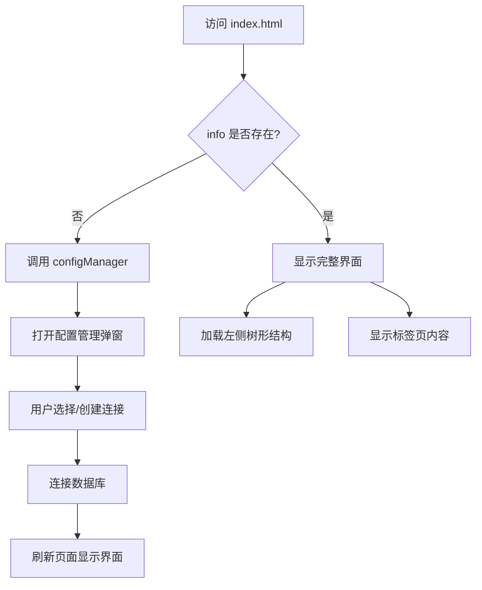

# WebDB Index.html 页面布局结构分析

## 📐 整体布局架构

```
┌─────────────────────────────────────────────────────────────┐
│                    顶部工具栏区域                              │
│  ┌──────────────────────────────────────────────────────┐   │
│  │ 文件 | 编辑 | 查询 | 工具 | 帮助                        │   │
│  │ [📁] [🔗] [🔄] [▶] [🗔] [🔍]                          │   │
│  └──────────────────────────────────────────────────────┘   │
├─────────────────────────────────────────────────────────────┤
│                    主内容区域                                 │
│  ┌──────────┬──────────────────────────────────────────┐   │
│  │          │                                           │   │
│  │  左侧    │           右侧标签页区域                    │   │
│  │  树形    │  ┌────────────────────────────────────┐  │   │
│  │  菜单    │  │ [主机信息] [查询]                    │  │   │
│  │          │  ├────────────────────────────────────┤  │   │
│  │  (25%)   │  │                                    │  │   │
│  │          │  │        标签页内容区                  │  │   │
│  │          │  │                                    │  │   │
│  │          │  │        (75%)                       │  │   │
│  │          │  │                                    │  │   │
│  │          │  └────────────────────────────────────┘  │   │
│  └──────────┴──────────────────────────────────────────┘   │
└─────────────────────────────────────────────────────────────┘
```

## 🎯 布局层次结构

### 1️⃣ 条件渲染逻辑
```freemarker
<#if info?exists>
    <!-- 已连接数据库：显示完整界面 -->
<#else>
    <!-- 未连接：自动打开配置管理器 -->
</#if>
```

**逻辑说明**：
- ✅ 如果 `info` 对象存在 → 显示完整的数据库管理界面
- ❌ 如果 `info` 不存在 → 自动调用 `configManager()` 打开连接配置

---

## 📋 区域详细分析

### 🔝 区域 1：顶部工具栏 (Header Toolbar)

#### 结构组成
```html
<div class="layui-panel layui-card-header">
  <table>
    <tr> <!-- 第一行：菜单文字 --> </tr>
    <tr> <!-- 第二行：工具按钮 --> </tr>
  </table>
</div>
```

#### 第一行：菜单栏
| 菜单项 | ID | 功能说明 | 对应脚本 |
|--------|-----|----------|----------|
| 文件 | `fileMenu` | 文件操作（新建、打开、保存等） | fileMenu.js |
| 编辑 | `editMenu` | 编辑操作（复制、粘贴、查找等） | editMenu.js |
| 查询 | `queryMenu` | 查询相关功能 | queryMenu.js |
| 工具 | `toolMenu` | 工具集合 | toolMenu.js |
| 帮助 | `helpMenu` | 帮助文档 | helpMenu.js |

#### 第二行：工具按钮
| 图标 | 功能 | 状态 | 说明 |
|------|------|------|------|
| 📁 `layui-icon-folder-open` | 会话管理 | ✅ 已实现 | 打开数据库连接配置管理 |
| 🔗 `layui-icon-link` | 连接 | ⚠️ 待开发 | 连接/断开数据库 |
| 🔄 `layui-icon-refresh` | 刷新 | ⚠️ 待开发 | 刷新当前视图 |
| ▶️ `layui-icon-triangle-r` | 执行 | ⚠️ 待开发 | 执行 SQL 查询（绿色按钮） |
| 🗔 `layui-icon-layer` | 新窗口 | ✅ 已实现 | 在新标签页打开 |
| 🔍 `layui-icon-search` | 搜索 | ⚠️ 待开发 | 搜索功能 |

**样式特点**：
- 背景色：`#F2F2F2`（浅灰色）
- 按钮尺寸：`layui-btn-xs`（超小尺寸）
- 按钮类型：`layui-btn-primary`（次要按钮）
- 执行按钮：`layui-btn-normal`（主要按钮，绿色）

---

### 📊 区域 2：主内容区 (Main Content Area)

使用 Layui 栅格系统：`layui-row` + `layui-col-xs*`

#### 2.1 左侧面板 (25% 宽度)
```html
<div class="layui-col-xs3">
  <div id="leftTree"></div>
</div>
```

**功能**：
- 显示数据库树形结构
- 使用 zTree 插件渲染
- 展示：数据库 → 表 → 字段层级结构

**技术栈**：
- jQuery zTree 插件
- 配置文件：`leftTree.js`
- 样式：`zTreeStyle.css`

**预期功能**（待开发）：
- 📂 展开/折叠数据库节点
- 📋 显示表列表
- 🔍 右键菜单（查看表结构、数据等）
- 🔄 刷新树形结构

---

#### 2.2 右侧面板 (75% 宽度)
```html
<div class="layui-col-xs9">
  <div class="layui-tabs layui-tabs-card">
    <ul class="layui-tabs-header">
      <li>${info.host!"未连接"}</li>
      <li>查询</li>
    </ul>
    <div class="layui-tabs-body">
      <div class="layui-tabs-item"><!-- 标签页1内容 --></div>
      <div class="layui-tabs-item"><!-- 标签页2内容 --></div>
    </div>
  </div>
</div>
```

**标签页结构**：

| 标签页 | 标题 | 内容 | 状态 |
|--------|------|------|------|
| Tab 1 | 主机信息 | 显示 `${info.host}` | ⚠️ 内容待开发 |
| Tab 2 | 查询 | SQL 查询编辑器 | ⚠️ 待开发 |

**预期功能**（待开发）：
- 📝 SQL 编辑器（代码高亮、自动补全）
- 📊 查询结果表格展示
- 📈 数据可视化
- 💾 导出数据功能
- 📋 表结构查看
- ✏️ 数据编辑功能

---

## 🎨 样式设计

### 自定义样式
```css
.layui-card-header {
    background-color: #F2F2F2;  /* 浅灰背景 */
    color: #333;                /* 深灰文字 */
    font-size: 16px;            /* 字体大小 */
    border-bottom: 1px solid #ddd; /* 底部边框 */
    padding: 7px;
    padding-right: 10px;
}

td {
    padding-right: 10px;        /* 单元格右边距 */
}
```

### 响应式设计
- 使用 Layui 栅格系统
- `layui-col-xs3` / `layui-col-xs9` = 3:9 比例
- 适配移动端：`<meta name="viewport" content="width=device-width, initial-scale=1">`

---

## 🔧 技术依赖

### 前端框架
| 库/框架 | 版本 | 用途 |
|---------|------|------|
| Layui | - | UI 框架（栅格、按钮、标签页） |
| jQuery | 1.4.4 | DOM 操作 |
| zTree | - | 树形控件 |

### 模板引擎
- **Freemarker**：服务端模板渲染
- 变量：`${info.host}`, `${errorInfo}`
- 条件：`<#if info?exists>`

### JavaScript 模块
```javascript
fileMenu.js    // 文件菜单功能
editMenu.js    // 编辑菜单功能
queryMenu.js   // 查询菜单功能
toolMenu.js    // 工具菜单功能
helpMenu.js    // 帮助菜单功能
leftTree.js    // 左侧树形菜单
```

---

## 🚀 交互流程

### 初始加载流程


### 错误处理
```javascript
window.onload = function() {
    configManager();           // 打开配置管理
    if(errorInfo) {
        layer.msg(errorInfo);  // 显示错误信息
    }
}
```

---

## 📝 待开发功能清单

### 🔴 高优先级
1. ✅ **会话管理** - 已实现
2. ⚠️ **左侧树形菜单** - 结构已有，功能待完善
   - 加载数据库列表
   - 加载表列表
   - 右键菜单
3. ⚠️ **SQL 查询编辑器** - 待开发
   - 代码编辑器集成（Monaco Editor / CodeMirror）
   - 语法高亮
   - 自动补全
4. ⚠️ **查询结果展示** - 待开发
   - 表格展示
   - 分页功能
   - 数据导出

### 🟡 中优先级
5. ⚠️ **工具栏按钮功能** - 大部分待开发
   - 连接/断开
   - 刷新
   - 执行查询
   - 搜索
6. ⚠️ **菜单功能** - 待开发
   - 文件菜单（新建、保存、导入、导出）
   - 编辑菜单（复制、粘贴、查找替换）
   - 查询菜单（查询历史、保存查询）
   - 工具菜单（数据库工具）

### 🟢 低优先级
7. ⚠️ **表结构查看** - 待开发
8. ⚠️ **数据编辑** - 待开发
9. ⚠️ **数据可视化** - 待开发
10. ⚠️ **帮助文档** - 待开发

---

## 🎯 布局优化建议

### 1. 响应式改进
```css
/* 建议添加媒体查询 */
@media (max-width: 768px) {
    .layui-col-xs3 { width: 100%; }
    .layui-col-xs9 { width: 100%; }
}
```

### 2. 可调整分割线
- 建议使用可拖拽的分割线
- 允许用户自定义左右面板宽度

### 3. 工具栏优化
- 添加工具提示（tooltip）
- 按钮分组（使用分隔符）
- 添加快捷键提示

### 4. 标签页增强
- 支持关闭标签页
- 支持拖拽排序
- 支持右键菜单

---

## 📊 布局比例分析

```
总宽度: 100%
├─ 顶部工具栏: 100% × 自适应高度
└─ 主内容区: 100% × (100vh - 工具栏高度)
   ├─ 左侧面板: 25% (layui-col-xs3)
   └─ 右侧面板: 75% (layui-col-xs9)
```

---

## 🔍 关键代码片段

### 条件渲染
```freemarker
<#if info?exists>
    <!-- 已连接：显示完整界面 -->
<#else>
    <!-- 未连接：打开配置管理 -->
    <script>
        window.onload = function() {
            configManager();
        }
    </script>
</#if>
```

### 栅格布局
```html
<div class="layui-row">
  <div class="layui-col-xs3">左侧 25%</div>
  <div class="layui-col-xs9">右侧 75%</div>
</div>
```

### 标签页
```html
<div class="layui-tabs layui-tabs-card">
  <ul class="layui-tabs-header">
    <li>标签1</li>
    <li>标签2</li>
  </ul>
  <div class="layui-tabs-body">
    <div class="layui-tabs-item">内容1</div>
    <div class="layui-tabs-item">内容2</div>
  </div>
</div>
```

---

## 🎨 设计参考

该布局设计参考了经典的数据库管理工具界面：
- **phpMyAdmin** - 左侧数据库树 + 右侧操作区
- **Navicat** - 顶部工具栏 + 左右分栏
- **MySQL Workbench** - 多标签页设计

---

## 📌 总结

**当前状态**：
- ✅ 基础布局框架完成
- ✅ UI 组件集成完成
- ⚠️ 大部分功能逻辑待开发

**核心特点**：
1. 清晰的三层布局（工具栏 + 左侧树 + 右侧标签页）
2. 响应式设计（Layui 栅格系统）
3. 模块化 JavaScript（功能分离）
4. 条件渲染（连接状态判断）

**下一步开发重点**：
1. 完善左侧树形菜单数据加载
2. 实现 SQL 查询编辑器
3. 开发查询结果展示功能
4. 完善工具栏按钮功能
